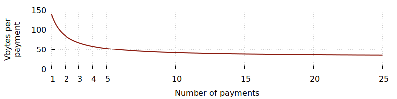
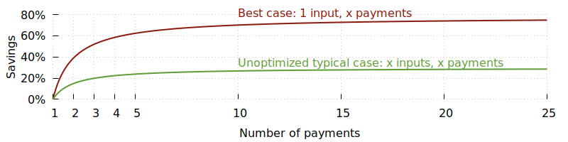
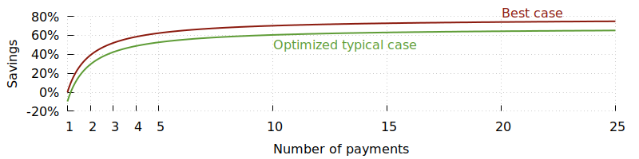
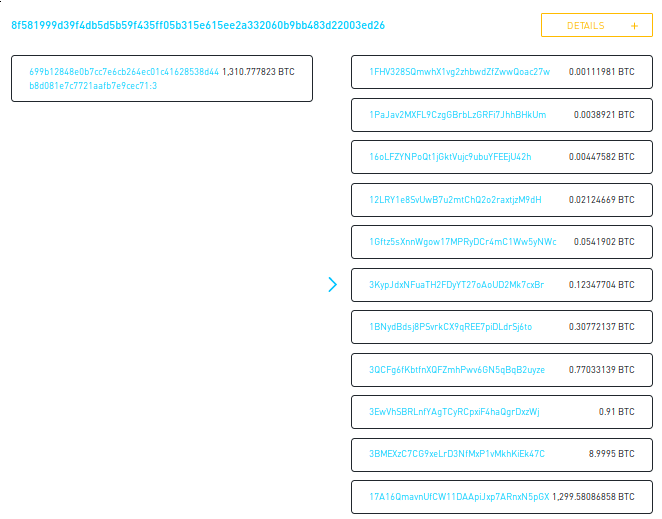

This chapter describes how
high-frequency spenders can use the scaling technique of *payment
batching* to reduce transaction sizes and fees by about 75% in
practical situations.
As of February 2019, payment batching is used by multiple popular
Bitcoin services (mainly exchanges), is available as a built-in feature
of many wallets (including Bitcoin Core), and should be easy to
implement in custom wallets and payment-sending solutions.  On the
downside, use of the technique can lead to temporary unexpected behavior
for the receivers of payments, a possible inability to fee bump, and may result in a reduction of privacy.

## Transaction size per receiver

A typical Bitcoin transaction using P2WPKH inputs and outputs contains
one input from the spender of about 67 vbytes and two outputs of about
31 vbytes each, one to the receiver and one as change back to the
spender.  An additional 11 vbytes are used for transaction overhead
(version, locktime, and other fields).



If we add just 4 more receivers, including an additional 31 vbyte output
for each one of them, but otherwise keep the transaction the same, the
total size of the transaction becomes 264 vbytes.  Whereas the previous
transaction used all 140 vbytes to pay a single receiver, the batched
transaction uses only about 53 vbytes per receiver---a bit over 60%
savings per payment.

Extrapolating this simple best-case situation, we see that the number of
vbytes used per receiver asymptotically approaches the size of a single
output.  This makes the maximum savings possible a bit over 75%.



Realistically, the more a transaction spends, the more likely it is to
need additional inputs.  This doesn't prevent payment batching from
being useful, although it does reduce its effectiveness.  For example,
we expect a typical service to
receive payments of about the same value as the payments they make, so
for every output they add, they need to add one input on average.
Savings in this typical case peak at about 30%.

Services that find themselves frequently using more than one input per
transaction may be able to increase their savings using a two-step
procedure.  In the first step, multiple small inputs are
consolidated into a single larger input using
slow (but low-feerate) transactions that spend the service's money back
to itself.  In the second step, the service spends from one of its
consolidated inputs using payment batching and achieves the best-case
efficiency described above.

If we assume that consolidation transactions will pay only 20% of the
feerate of a normal transaction and will consolidate 100 inputs at a
time, we can calculate the savings of using the two-step procedure for
our one input per output scenario above (while showing, for comparison,
the simple best-case scenario of already having a large input available).



For the typical case,
consolidation loses efficiency when only making a single payment,
but when actually batching, it performs almost as well as the best case
scenario.

In addition to payment batching directly providing a fee savings,
batching also uses limited block space more efficiently by reducing the
number of vbytes per payment.  This increases the available supply of
block space and so, given constant demand, can make it more affordable.
In that way, increased use of payment batching may lower the feerate for
all Bitcoin users.

In summary, payment batching provides significant savings for services
that typically have inputs available that are 5 to 20 times larger than
their typical output.  For services not in that position, the savings
from batching alone are smaller but perhaps still worth the effort;
if the services are willing to also pre-consolidate their inputs, the
savings can be quite dramatic.

Note: the figures and plots above all assume use of P2WPKH inputs and
outputs.  We expect that to become the dominant script type on the
network in the future (until something better comes along).  However, if
you use a different script type (P2PKH, or multisig using P2SH or
P2WSH), the number of vbytes used to spend them are even larger, so the
savings rate will be higher.

## Concerns

The fee-reduction benefits of payment batching do create tradeoffs and
concerns that will need to be addressed by any service using the
technique.

### Delays

This is the primary concern with payment batching.  Although some
situations naturally lend themselves to payment batching (e.g. a mining
pool paying hashrate providers in a block the pool mined), many
services primarily send money to users when those users make a
withdrawal request.  In order to batch payments, the service must get
the user to accept that their payment will not be sent immediately---it
will be held for some period of time and then combined with other
withdrawal requests.

Users will notice this delay because they won't receive a notification
in their receiving wallet that an unconfirmed transaction is on the way
until you send the batch containing their payment.  Also by delaying
sending of their payment, you also delay when it's confirmed (all other
things being equal, such as feerates).

To mitigate the problem of delays, you may allow the
user to choose between an immediate payment and a delayed payment with
a different fee provided for each option.  For example:

    [X] Free withdrawal (payment sent within 6 hours)
    [ ] Immediate withdrawal (withdrawal fee 0.123 mBTC)

### Reduced privacy

A second concern with payment batching is that it can make users feel
like they have less privacy.  Every user you pay in the same transaction
can reasonably assume that everyone else receiving an output from that
transaction is being paid by you.  If you had sent separate
transactions, any onchain relationship between the payments might be
less apparent or even non-existent.



Note that transactions belonging to particular Bitcoin services are
often identifiable by experts even if they don't use payment
batching, so batching doesn't necessarily cause a reduction in privacy
for those cases.

It may be possible to partially mitigate this problem by sending batched
payments in a coinjoin transaction created with other users.  Depending
on the technique used, this would not necessarily reduce the efficiency
of batching and could provide significantly enhanced privacy.  However,
naive implementations of coinjoin previously provided by Bitcoin
services have had [flaws][coinjoin sudoku] that prevented them from
providing significant privacy advantages.  As of February 2019, no
currently-available coinjoin implementation is fully compatible with the
needs of payment batching.

### Possible inability to fee bump

A final concern is that you may not be able to fee bump a batched
payment.  Transaction relay nodes such as Bitcoin Core impose limits on
the transactions they relay to prevent attackers from wasting bandwidth,
CPU, and other node resources.  By yourself, you can easily avoid
reaching these limits, but the receivers of the payments you send can
respend their outputs in child transactions that become part of the
transaction group containing your transaction.

The closer to a limit a transaction group becomes, the less likely
you'll be able to fee bump your transaction using either
Child-Pays-for-Parent (CPFP) fee bumping or Replace-by-Fee (RBF) fee
bumping.  In addition, the more unconfirmed children a transaction has,
the more RBF fee bumping will cost as you'll have to pay for both the
increased feerate of your transaction as well as for all the potential
fees lost to miners when they remove any child transactions in order
to accept your replacement.

Note that these problems are not unique to batched payments---independent
payments can have the same problem.  However, if an independent payment
can't be fee bumped because the independent receiver spent their output,
only that user is affected.  But if a single receiver of a batched
payment spends their output to the point where fee bumping becomes
impossible, all the other receivers of that transaction are also affected.

As of Bitcoin Core 0.18 (April 2019), the limits are[^package-limits] that a
group of related unconfirmed transactions may not exceed 101,000 vbytes
in size, have more than 25 unconfirmed ancestors, or have more than 25
descendants.  This size limit restricts batches to a maximum size of
about 3,000 outputs and the descendant limit is easily reached if just a
tiny percentage of those receiving a large batch respend their confirmed
outputs.  It's also easy for any of the receivers to deliberately create
transactions that reach one of these limits and prevent fee bumping if
they know that you're relying on that capability.

## Implementation

Payment batching is extremely easy using certain existing wallet
implementations, such as using Bitcoin Core's [sendmany][] RPC.  Check your software
documentation for a function that allows you to send multiple payments.

```bash
bitcoin-cli sendmany "" '{
  "bc1q5c2d2ue7x38hcw2ugk5q7y4ae7nw4r6vxcptu8": 0.1,
  "bc1qztjzd7hpf2xmngr7zkgkxsvdqcv2jpyfgwgtsv": 0.2,
  "bc1qsul9emtnz0kks939egx2ssa6xnjpsvgwq9chrw": 0.3
}'
```

<!-- for max standard tx size: src/policy/policy.h:static const unsigned int MAX_STANDARD_TX_WEIGHT = 400000; -->

If using your own implementation, you are probably already creating
transactions with two outputs in most cases (a payment output and a
change output), so it should be easy to add
support for additional outputs.  The only notable consideration is that
Bitcoin Core nodes (and most other nodes) will refuse to accept or relay
transactions over 100,000 vbytes, so you should not attempt to send
batched payments larger than this.

## Recommendations summary

1. Try to create systems where your users and customers don't expect
   their payments immediately but are willing to wait for some time
   (the longer the better).

2. Use low-feerate consolidations to keep some large inputs available
   for spending.

3. Within each time window, send all payments together in the same
   transaction.  For example, create an hourly [cronjob][] that sends all pending payments.
   Ideally, your prior consolidations should allow the
   transaction to contain only a single input.

4. Don't depend on being able to fee bump the batched payments.  This
   means using a high-enough feerate on the initial transaction to
   ensure it has a high probability of confirming within your desired
   time window. For example, use the `CONSERVATIVE` mode of Bitcoin
   Core's `estimatesmartfee` RPC.

## Footnotes

[^package-limits]:
    Optech believes that almost all nodes are using the default Bitcoin
    Core policy for transaction group limits.  However, those defaults
    may change over time, so the example below provides a command that
    can be used to find the current limits along with the current
    values.

    ```text
    $ bitcoind -help-debug | grep -A3 -- -limit
      -limitancestorcount=<n>
           Do not accept transactions if number of in-mempool ancestors is <n> or
           more (default: 25)

      -limitancestorsize=<n>
           Do not accept transactions whose size with all in-mempool ancestors
           exceeds <n> kilobytes (default: 101)

      -limitdescendantcount=<n>
           Do not accept transactions if any ancestor would have <n> or more
           in-mempool descendants (default: 25)

      -limitdescendantsize=<n>
           Do not accept transactions if any ancestor would have more than <n>
           kilobytes of in-mempool descendants (default: 101).
    ```


[coinjoin sudoku]: http://www.coinjoinsudoku.com/
[fee bumping]: ../1.fee_bumping/fee_bumping.md
[cronjob]: https://en.wikipedia.org/wiki/Cronjob
[sendmany]: https://bitcoincore.org/en/doc/0.17.0/rpc/wallet/sendmany/
